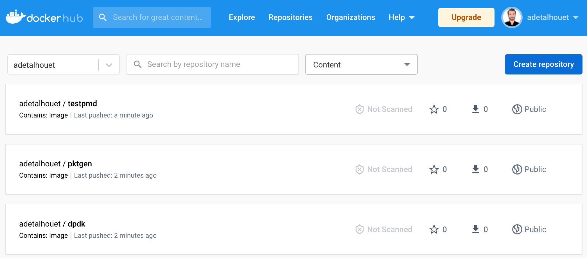

# aarch64-dpdk-ocp-pipeline

TODO
- parameterize pipeline

## pre-requisite

- [Install OpenShift Pipeline](https://docs.openshift.com/container-platform/4.11/cicd/pipelines/installing-pipelines.html)

## deploy the pipeline

```
oc apply -f build-dpdk-pipeline.yaml
```

Add dockerhub secret in order to push the image.

```
oc create secret docker-registry dockerhub \ 
    --docker-server=docker.io \
    --docker-username=YOURUSERNAME \ 
    --docker-password=xxx

oc secrets link pipeline dockerhub --for=mount
```

## run the pipeline

```
oc apply -f build-dpdk-pipeline-run.yaml
```

# Result

